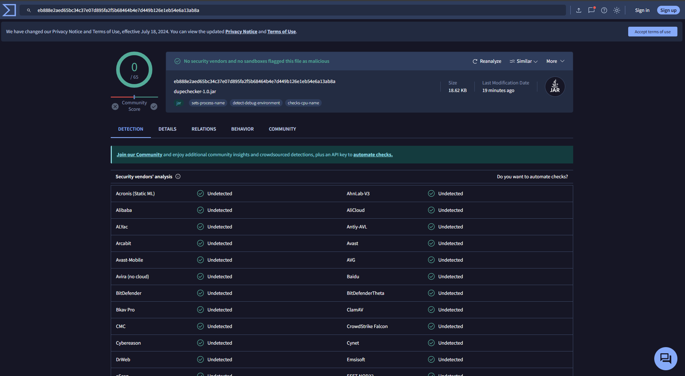

<h1 align="center">SkyBlock DupeChecker</h1>

    <!-- release -->
    

DupeChecker mod for hypixel skyblock

- there are 2 versions availabe for this mod: a standalone jar file, & a ChatTriggers module

**Note: The standalone jar does not work for the latest release**

## How does it work?
While in-game type '**/dupecheck**'! Our mod will send a request to our api to check if an item with the same uuid has already been registered by another user, it will then enter in chat its suspicions about the item.

The API will also update it's database with YOUR items! This means that the more people using the mod, the more accurate our model will be!

## How to install?
We made yall an easy to follow guide with full download & use instructions:

✅ Guide how to run the mod! ✅
 1. Download Forge 1.8.9
 2. Go to \AppData\Roaming\.minecraft
 3. Put the downloaded mod in the mods folder
 4. In the minecraft launcher, select the version of minecraft 1.8.9 forge
 5. And start minecraft
 6. Enjoy the game!

## If any question write in discord: shrekonskyblock

## We encourage you to try & verify authenticity yourself.

**[Verified by isthisarat.com](isthisarat.com)**

.

**[Verified by virustotal.com](virustotal.com)**

